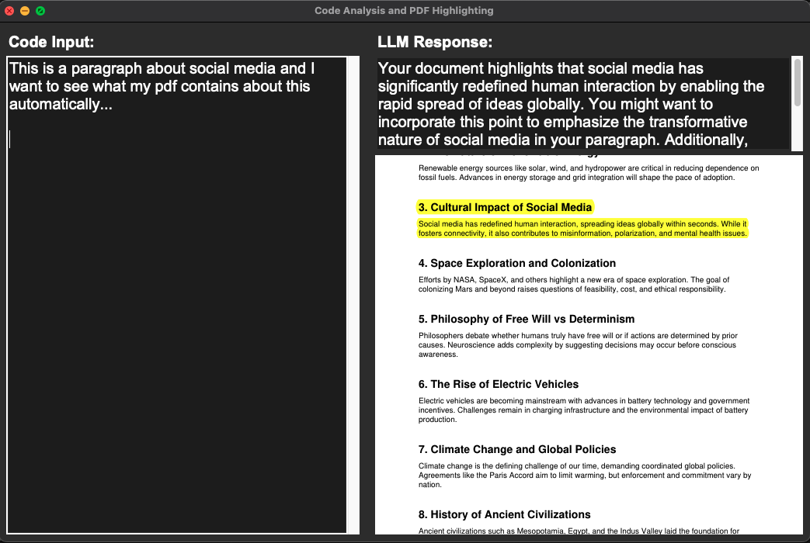

# Realtime-Writing-Retriever



This project automatically retrieves relevant information from your documents and guidelines as you write. When you enter text into the application, it uses AI-powered search and language models to find and highlight the most applicable rules or advice from your documents (such as PDFs or markdown files). For example, if you’re drafting a report, writing a technical document, or even coding, the tool will surface related guidelines or best practices—without you needing to search manually. This helps ensure your work adheres to standards and leverages the right information.

## How it Works

The project consists of two main components:

1.  **`indexer.py`**: This script reads your documents from the `Docs/` directory, extracts text, and creates a searchable vector index using FAISS. It processes PDFs and Markdown files, breaking them down into smaller, embeddable chunks. These chunks are then converted into vector embeddings using OpenAI's API and stored in a FAISS index file (`Index/faiss_index.pkl`).

2.  **`main.py`**: This is the main application, which provides a graphical user interface (GUI) built with Tkinter. As you type into the input area, the application:
    *   Takes your text and generates an embedding for it.
    *   Searches the FAISS index to find the most relevant text snippets from your documents.
    *   Uses an OpenAI language model to generate advice or highlight potential issues based on the retrieved context.
    *   Displays the relevant page of the original PDF and highlights the text that was found, giving you immediate context.

## Setup and Usage

To get started with this project, follow these steps:

1.  **Clone the repository and install dependencies:**

    ```bash
    git clone <repository-url>
    cd GuidanceEngine
    pip install -r requirements.txt
    ```

2.  **Set up your environment:**

    Create a `.env` file in the root of the project and add your OpenAI API key:

    ```
    OPENAI_API_KEY="your-openai-api-key"
    ```

3.  **Add your documents:**

    Place any PDF or Markdown files you want to be included in the search into the `Docs/` directory.

4.  **Run the indexer:**

    Before running the main application, you need to create the FAISS index from your documents. Run the following command in your terminal:

    ```bash
    python indexer.py
    ```

    This will create the `Index/faiss_index.pkl` file, which the main application uses for searching.

5.  **Run the application:**

    Once the index is created, you can start the main application:

    ```bash
    python main.py
    ```

    This will open the GUI, where you can start writing and see relevant information from your documents in real-time.
